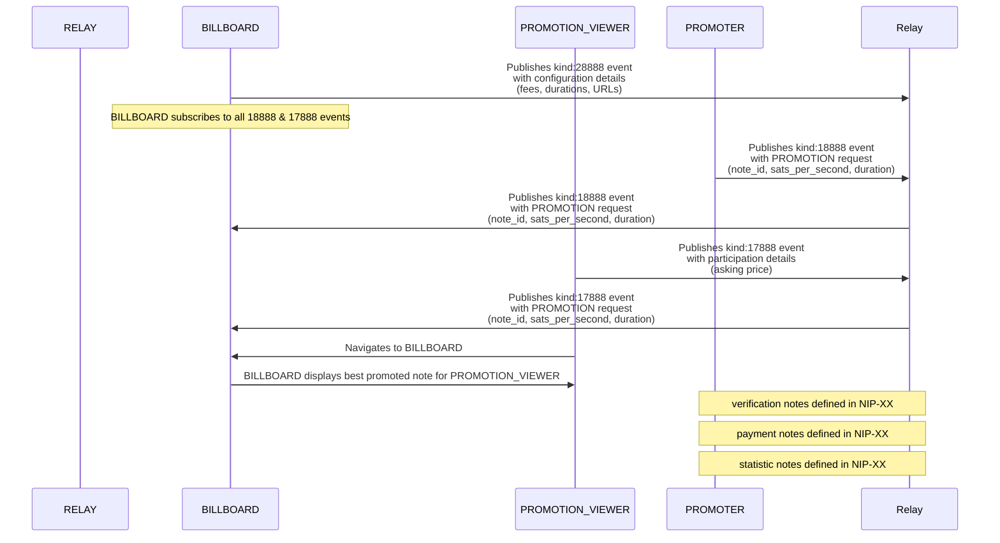

# NIP-X1 - BASIC PROTOCOL
`draft` `mandatory`

## Abstract
NIP-X1 defines the core decentralized protocol for content promotion on Nostr, establishing standardized event kinds and communication patterns between participants. The protocol establishes a market-driven system connecting PROMOTERS who wish to promote content with PROMOTION VIEWERS who are willing to view it, facilitated by BILLBOARD verification nodes. This foundation enables a transparent, decentralized alternative to traditional advertising systems while preserving Nostr's core principles of user sovereignty and decentralization.

## Protocol Components

### NEW TAGS
- `b` - the pubkey of a BILLBOARD operator that the sender trusts

### NEW EVENT KINDS
- **kind:28888**: BILLBOARD configuration event
- **kind:18888**: PROMOTER promotion request event
- **kind:17888**: PROMOTION VIEWER availability event

## Key Components

### Protocol Participants
- **Relay**: Standard Nostr relay servers that propagate events between participants
- **PROMOTERS**: Nostr pubkeys that publish kind:18888 events to promote specific notes
- **PROMOTION VIEWERS**: Nostr pubkeys that publish kind:17888 events to signal availability for viewing promoted content
- **BILLBOARDs**: Verification nodes that publish kind:28888 events, match PROMOTERS with PROMOTION VIEWERS, and validate content viewing

### Event Schema Implementation
- **kind:28888**: Defines BILLBOARD parameters
  - Fee structure (percentage or fixed amount)
  - Duration constraints (minimum/maximum viewing time)
  - Update interval (frequency of PROMOTION rotation)
  - Service endpoints (primary/backup URLs)
  - Relay preferences (read/write specifications)

- **kind:18888**: Defines PROMOTION parameters
  - Target note_id (event to be promoted)
  - sats_per_second amount (payment offered per view)
  - Duration requirement (viewing time needed)
  - Trusted BILLBOARD specification (pubkey and relay)

- **kind:17888**: Defines PROMOTION VIEWER parameters
  - Asking price (payment required per view)
  - Maximum duration (upper limit on viewing time)
  - Accepted BILLBOARD specification (pubkey and relay)


## Event Specifications

### BILLBOARD Configuration
Event kind:28888 defining BILLBOARD parameters

```json
{
    "kind": 28888,
    "pubkey": "<BILLBOARD_pubkey>",
    "content": "",
    "created_at": UNIX_TIMESTAMP,
    "tags": [
        ["max_duration", "<value>", "seconds"],
        ["min_duration", "<value>", "seconds"],
        ["interval", "<value>", "seconds"],
        ["fee", "<value>", "percent|sats"],
        ["min_fee", "<value>", "sats"],
        ["u", "<url>", "primary"],
        ["u", "<url>", "backup"],
        ["nip", "X1"]
    ]
}
```

#### Required Tags
- `interval`: Update frequency in seconds - how often the BILLBOARD updates promotion matching
- `fee`: BILLBOARD commission (percent or fixed sats) - payment the BILLBOARD takes for services
- `u`: List of BILLBOARD endpoint URLs - service endpoints where PROMOTION VIEWERS can view PROMOTIONS
- `nip`: List of PROMO PROTOCOL Implemented NIP versions - indicates which protocol features are supported

#### Optional Tags
- `max_duration`: Maximum allowed view duration - upper limit on how long promotions can be
- `min_duration`: Minimum allowed view duration - lower limit on how long promotions must be
- `min_fee`: Minimum commission in sats - floor value for BILLBOARD fees regardless of percentage

### PROMOTER Event
Event kind:18888 from PROMOTERS requesting note promotion

```json
{
    "kind": 18888,
    "pubkey": "<PROMOTER_pubkey>",
    "content": "",
    "created_at": UNIX_TIMESTAMP,
    "tags": [
        ["e", "<note_id>"],
        ["duration", "<value>", "seconds"],
        ["sats_per_second", "<value>"],
        ["b", "<BILLBOARD_pubkey>", "<relay_url>"]
    ]
}
```

#### Required Tags
- `e`: ID of note to promote
- `duration`: Required view duration
- `sats_per_second`: Payment amount per view
- `b`: List of trusted BILLBOARD pubkey and relay

### PROMOTION VIEWER Event
Event kind:17888 from PROMOTION VIEWERS setting view parameters

```json
{
    "kind": 17888,
    "pubkey": "<PROMOTION_VIEWER_pubkey>",
    "content": "",
    "created_at": UNIX_TIMESTAMP,
    "tags": [
        ["max_duration", "<value>", "seconds"],
        ["sats_per_second", "<value>"],
        ["b", "<BILLBOARD_pubkey>", "<relay_url>"]
    ]
}
```

#### Required Tags
- `sats_per_second`: Required payment per view
- `b`: List of trusted BILLBOARD pubkey and relay

#### Optional Tags
- `max_duration`: Maximum viewing duration

## Protocol Behavior

### PROMOTION Lifecycle
- PROMOTIONS are initiated when PROMOTERS publish kind:18888 events
- A PROMOTION remains active until one of:
  1. The PROMOTER publishes a kind:5 event referencing the PROMOTION event ID
  2. The BILLBOARD terminates the PROMOTION based on its criteria
- BILLBOARDs MUST:
  - Monitor for kind:5 events referencing active PROMOTIONS
  - Remove PROMOTIONS immediately upon detecting valid deletion events

### BILLBOARD Requirements
- MUST validate all duration values against configured limits
- MUST reject PROMOTIONS where PROMOTION sats_per_second < PROMOTION VIEWER sats_per_second
- MUST attempt BILLBOARD URLs in specified order
- MUST operate on specified relays according to read/write designation
- MUST honor fee structure specified in configuration

### Client Requirements
- SHOULD publish events to BILLBOARD's write/both relays
- SHOULD monitor BILLBOARD's read/both relays
- MUST respect BILLBOARD's minimum duration requirements
- MUST include valid BILLBOARD pubkey in events

## Flow Diagram


### Trust Model
- PROMOTERS specify trusted BILLBOARDs in PROMOTION requests
- PROMOTION VIEWERS specify accepted BILLBOARDs in participation events
- Trust relationships are sovereign and market-driven
- No central BILLBOARD authority required

### Basic Workflow

1. **Registration**: BILLBOARD OPERATORS publish BILLBOARD DETAIL(kind:28888) event(s) announcing their BILLBOARD
2. **PROMOTION VIEWER Availability**: PROMOTION VIEWERS publish OPT-IN(kind:17888) event(s) indicating willingness to view PROMOTIONS
3. **PROMOTER Request**: PROMOTERS publish PROMOTION(kind:18888) event(s) to promote specific event
4. **Matching**: BILLBOARD OPERATORS match PROMOTIONS with PROMOTION VIEWERS when PROMOTION `sats_per_second` ≥ PROMOTION VIEWERS `sats_per_second`
5. **Verification**: BILLBOARD OPERATORS validates that PROMOTION VIEWERS viewed content for required duration