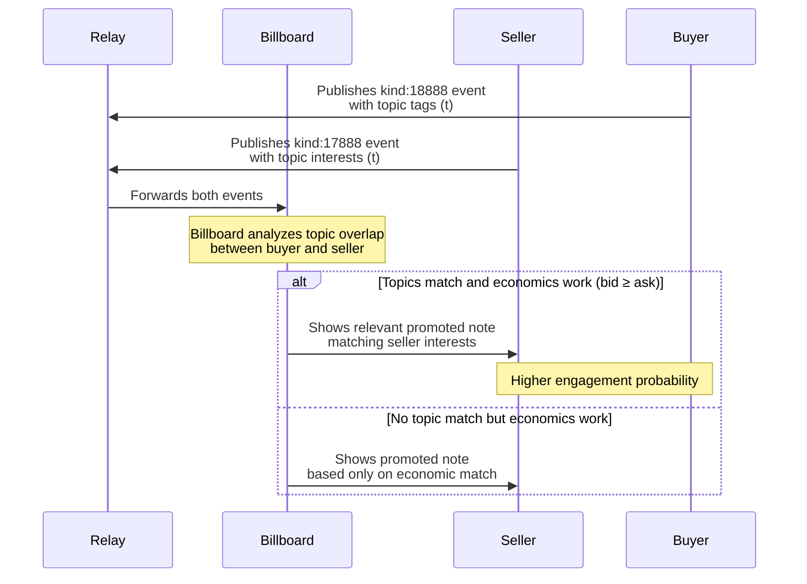

# NIP-X5 - BUYER TOPIC PREFERENCES

`draft` `optional`

## Abstract

This NIP defines a standardized mechanism for buyers in the Promoted Notes network to specify content topics for their promotions using the standard Nostr topic tag (`t`). By enhancing the buyer event (kind:18888) with topic tags, billboards can more effectively match promoted content with interested sellers, improving relevance and engagement for all marketplace participants.

## Motivation

While [NIP-X4](./NIP-X4-seller-prefernces.md) enables sellers to express content interests, buyers currently have no standardized way to categorize their promoted content. This NIP creates a bidirectional topic matching system that:

1. Increases promotion relevance and effectiveness
2. Improves conversion and engagement rates
3. Enables content-based targeting without compromising privacy
4. Creates a more efficient marketplace with better buyer-seller matching

## Implementation

### Topic Tags in Buyer Events

This NIP extends kind:18888 events to include the standard Nostr topic tag (`t`). No new tags are introduced, maintaining compatibility with existing Nostr conventions.

```json
{
  "kind": 18888,
  "pubkey": "<buyer_pubkey>",
  "content": "",
  "created_at": UNIX_TIMESTAMP,
  "tags": [
    ["e", "<note_id>"],
    ["duration", "<value>", "seconds"],
    ["sats_per_second", "<value>"],
    ["b", "<billboard_pubkey>", "<relay_url>"],
    ["t", "bitcoin"],
    ["t", "lightning"],
    ["t", "nostr"]
  ]
}
```

### Billboard Matching Behavior

Billboards implementing this NIP SHOULD:

1. Extract topic tags from both buyer (kind:18888) and seller (kind:17888) events
2. Prioritize matches where buyer and seller topics overlap
3. Implement case-insensitive topic matching (e.g., "bitcoin" matches "Bitcoin")
4. Consider topic matching as a significant factor in the promotion selection algorithm
5. Continue honoring all economic constraints (bid ≥ ask) as defined in [NIP-X1](./NIP-X1-basic-protocol.md)
6. Respect seller blacklist preferences from [NIP-X3](./NIP-X3-seller-blacklist.md) if implemented

### Content-Based Matching Algorithm

When both [NIP-X4](./NIP-X4-seller-topics.md) and [NIP-X5](./NIP-X5-buyer-topics.md) are implemented, billboards SHOULD:

1. First filter promotions based on economic criteria (bid ≥ ask)
2. Then prioritize promotions with topic overlap between buyer and seller
3. Use the number of matching topics as a weighting factor
4. For promotions with equal topic matches, prioritize by economic value

## Technical Details

### Topic Inheritance

Billboards SHOULD automatically extract topics from the promoted note content when possible, but explicitly tagged topics in the kind:18888 event take precedence. This allows buyers to specify the most relevant topics even when the note content covers multiple subjects.

### Performance Considerations

To maintain system efficiency:

1. Billboards SHOULD limit the number of topic tags processed per event (recommended: 10)
2. Topic matching SHOULD be optimized through indexing and caching
3. Billboards MAY implement topic normalization for improved matching

### Topic Standardization

While this NIP does not mandate a specific topic taxonomy, billboard operators are encouraged to:

1. Normalize topics to lowercase during matching
2. Strip special characters and spaces
3. Consider providing suggested topic lists to clients
4. Follow emerging conventions around common topics in the Nostr ecosystem

## Client Implementation Guidance

Client developers SHOULD:

1. Provide intuitive interfaces for buyers to add topic tags to promotions
2. Suggest popular or trending topics
3. Auto-extract potential topics from the note being promoted
4. Allow buyers to see topic matching statistics in their metrics
5. Educate buyers on effective topic selection for better targeting

## Examples

### Basic Topic Specification

```json
{
  "kind": 18888,
  "tags": [
    ["e", "<note_id>"],
    ["duration", "30", "seconds"],
    ["sats_per_second", "10"],
    ["b", "<billboard_pubkey>", "<relay_url>"],
    ["t", "bitcoin"],
    ["t", "technology"]
  ]
}
```

### Technical Article Promotion

```json
{
  "kind": 18888,
  "tags": [
    ["e", "<note_id>"],
    ["duration", "45", "seconds"],
    ["sats_per_second", "15"],
    ["b", "<billboard_pubkey>", "<relay_url>"],
    ["t", "programming"],
    ["t", "nostr"],
    ["t", "development"]
  ]
}
```

## Benefits and Outcomes

- **For Buyers**: Improved targeting and higher engagement rates
- **For Sellers**: More relevant content matching their interests
- **For Billboards**: Enhanced matching capabilities and value proposition
- **For Ecosystem**: More efficient marketplace with relevance-based incentives

## Integration with Existing NIPs

This NIP complements [NIP-X4](./NIP-X4-seller-prefernces.md) to create a complete topic-based matching system. Together, they enable:

1. Bidirectional content relevance matching
2. Topic-based marketplace optimization
3. Enhanced user experience for all participants

Billboards that implement both NIPs can provide significantly improved matching services.

## Compatibility

This NIP is fully compatible with:
- [NIP-X1](./NIP-X1-basic-protocol.md) (Basic Protocol for Promoted Notes)
- [NIP-X2](./NIP-X2-billboard-metrics.md) (Billboard Metrics)
- [NIP-X3](./NIP-X3-seller-blacklist.md) (Seller Preferences)
- [NIP-X4](./NIP-X4-seller-topics.md) (Seller Interests)

Billboards that do not implement this NIP will ignore buyer topic tags and continue functioning with basic economic matching as defined in NIP-X1.

## Flow Diagram


## References

1. [NIP-X1](./NIP-X1-basic-protocol.md): Basic Protocol for Promoted Notes
2. [NIP-X2](./NIP-X2-billboard-metrics.md): Billboard Metrics 
3. [NIP-X3](./NIP-X3-seller-blacklist.md): Seller Preferences
4. [NIP-X4](./NIP-X4-seller-topics.md): Seller Interests
