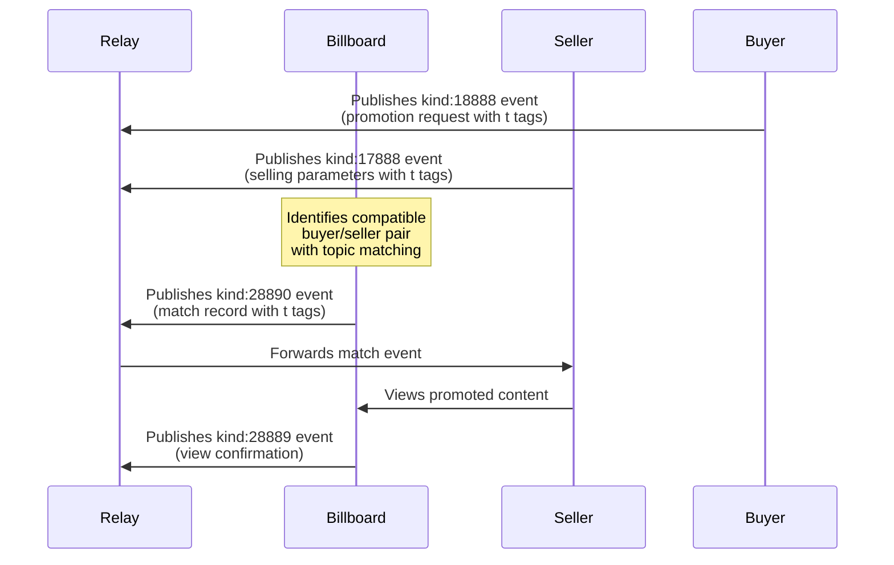

# Draft: NIP-X7 - BILLBOARD MATCH EVENT

`draft` `optional`

## Abstract
This NIP defines a standardized event kind and structure for billboards to publish when matching a buyer and seller in the Promoted Notes network. These match events serve as the connection point between promotion requests and viewing opportunities, enabling efficient pairing of content with appropriate viewers.

## Protocol Components

### NEW EVENT KINDS
- **kind:28890**: Billboard match event

## Key Components

### Match Event Properties
- **Connection Record**: Links a specific promotion with a specific seller
- **Match Timestamp**: Records when the match was created
- **Match Parameters**: Includes the economic and content parameters of the match
- **Topic Matching**: Optional record of which topics were used for matching
- **Expiration**: Optional expiration time for the match

## Event Specifications

### Match Event
Event kind:28890 creating a match between buyer promotion and seller

```json
{
    "kind": 28890,
    "pubkey": "<billboard_pubkey>",
    "content": "",
    "created_at": UNIX_TIMESTAMP,
    "tags": [
        ["e", "<buyer_event_id>", "<buyer_relay_url>"],
        ["p", "<buyer_pubkey>"],
        ["p", "<seller_pubkey>"],
        ["sats_per_second", "<value>"],
        ["duration", "<value>", "seconds"],
        ["t", "<matched_topic>"],
        ["t", "<matched_topic>"],
        ["expiration", "<unix_timestamp>"]
    ]
}
```

#### Required Tags
- `e`: Event ID of the buyer's kind:18888 promotion request
- `p`: First occurrence is buyer pubkey, second is seller pubkey
- `sats_per_second`: Agreed payment rate for the match
- `duration`: Required viewing duration

#### Optional Tags
- `t`: Topic that was used for matching (can appear multiple times)
- `expiration`: Unix timestamp after which this match is no longer valid (as defined in NIP-40)

## Protocol Behavior

### Match Lifecycle
1. Billboard identifies potential seller(s) for a promotion
2. Billboard evaluates economic match (bid ≥ ask)
3. Billboard evaluates topic match (if implemented from NIP-X4 and NIP-X5)
4. Billboard publishes kind:28890 match event
5. Match remains valid until:
   - Seller completes the view (resulting in kind:28889 confirmation)
   - Match expires (if expiration timestamp is reached)
   - Billboard publishes a kind:5 event referencing the match

### Billboard Requirements
- MUST verify economic compatibility before creating match
- MUST respect seller preferences (NIP-X3) if implemented
- SHOULD consider topic relevance (NIP-X4/X5) if implemented
- SHOULD include `t` tags for matched topics when topic matching was used
- MUST specify a reasonable expiration time if the match is time-limited

### Client Requirements
- Seller clients MAY subscribe to kind:28890 events referencing their pubkey
- Seller clients MAY display pending matches to users
- Client implementations SHOULD verify match validity before processing
- Client implementations MAY display matched topics to provide transparency

## Integration with Existing NIPs

This NIP complements the existing protocol by adding an explicit matching event:

- **NIP-X1 Integration**: Creates explicit record of the match implied in the basic protocol
- **NIP-X4/X5 Integration**: Records which topics were used for matching from seller and buyer preferences
- **NIP-X6 Connection**: Precedes the view confirmation events defined in NIP-X6
- **NIP-40 Integration**: Uses the standard expiration tag for time-limited events

## Flow Diagram


## Example Implementation

### Basic Match Event
```json
{
    "kind": 28890,
    "pubkey": "billboard123pubkey",
    "created_at": 1718734400,
    "tags": [
        ["e", "abcdef123456789", "wss://relay.example.com"],
        ["p", "buyer123pubkey"],
        ["p", "seller456pubkey"],
        ["sats_per_second", "10"],
        ["duration", "30", "seconds"],
        ["t", "bitcoin"],
        ["t", "nostr"],
        ["expiration", "1718738000"]
    ]
}
```

## Benefits for Ecosystem
1. Creates explicit record of buyer-seller matches
2. Enables better tracking of promotion flow
3. Allows sellers to see pending match opportunities
4. Provides transparency around topic-based matching
5. Creates foundation for advanced matching algorithms
6. Helps optimize topic selection by recording successful matches

## Compatibility
This NIP is fully compatible with:
- [NIP-X1](./NIP-X1-basic-protocol.md) (Basic Protocol for Promoted Notes)
- [NIP-X2](./NIP-X2-billboard-metrics.md) (Billboard Metrics)
- [NIP-X3](./NIP-X3-seller-blacklist.md) (Seller Preferences)
- [NIP-X4](./NIP-X4-seller-topics.md) (Seller Interests)
- [NIP-X5](./NIP-X5-buyer-topics.md) (Buyer Topic Preferences)
- [NIP-X6](./NIP-X6-billboard-confirmation.md) (Billboard Confirmation)
- [NIP-40](https://github.com/nostr-protocol/nips/blob/master/40.md) (Expiration Timestamp)